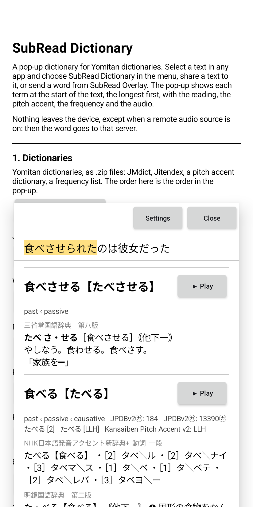
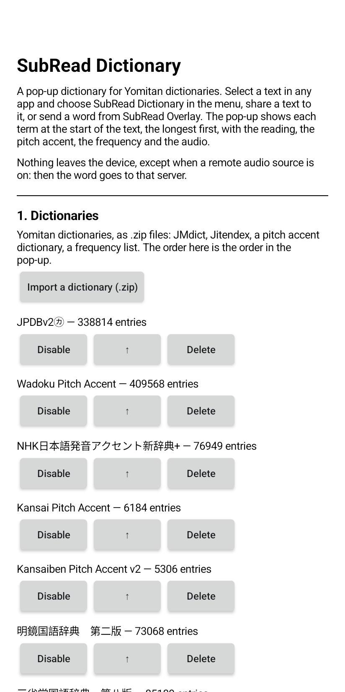

# SubRead Dictionary

A pop-up dictionary for Android that reads Yomitan dictionaries. Select a text
in any app and choose "SubRead Dictionary" in the text selection menu, share a
text to it, or send a word from
[SubRead Overlay](https://github.com/equwal/subread-overlay). The pop-up
opens over the app and shows each term at the start of the text, the longest
first, with the reading, the pitch accent, the frequency, and a button for
the audio. A tap on a character of the text looks up from there.

Nothing leaves the device, except when a remote audio source is on.

## Screenshots

<p>
  
  
</p>

The pictures are from a Viwoods AiPaper Reader.

## How to use it

1. Import a dictionary: a Yomitan `.zip` (JMdict, Jitendex, a pitch accent
   dictionary, a frequency list). The app reads format 3. The order of the
   dictionaries in the settings is the order in the pop-up.
2. Local audio, optional: choose the `android.db` of the
   [Local Audio Server for Yomitan](https://github.com/yomidevs/local-audio-yomichan),
   the same file that AnkiConnect Android and Hoshi Reader use. The app copies
   it into its folder. Or push it there with `adb`; the settings show the
   folder. The order of the sources is a setting: `jpod, jpod_alternate,
   nhk16, shinmeikai8, forvo`.
3. Remote audio, optional and off by default: one URL per line, with `{term}`
   and `{reading}`. A URL can answer with an audio file (JapanesePod101 is
   the default line), or with the JSON list of a Local Audio Server on the
   network: `http://192.168.1.2:5050/?term={term}&reading={reading}`. The
   remote sources come after the local ones.

In the pop-up, "Play" plays the first source that has the word. A long press
on "Play" lists every source.

## How it works

`:core` is plain Kotlin, with no Android in it:

- `YomitanZip` reads the zip as a stream, one term at a time.
- `Deinflector` has the Japanese rules of Yomitan: 食べさせられた → 食べる,
  with the word class of each step checked against the rules of the term.
- `Lookup` tries each prefix of the text, the longest first, and each
  dictionary form of it, in one query.
- `Glossary` turns the structured content of a term into the simple HTML
  that a `TextView` shows.

`:app` has the SQLite store of the terms, the settings screen, the pop-up and
the audio.

## For other apps

Send a text with any of these; the pop-up opens over your app:

- `Intent.ACTION_PROCESS_TEXT` with `EXTRA_PROCESS_TEXT` (the text selection menu).
- `Intent.ACTION_SEND`, `text/plain`, with `EXTRA_TEXT` (the share sheet).
- The action `space.subread.dictionary.LOOKUP` with `EXTRA_TEXT`.

Ask for the terms of a text, or the audio of a term, without the pop-up: the
content provider `space.subread.dictionary.lookup`, see
[docs/provider-api.md](docs/provider-api.md). SubRead Anki uses it.

## Anki cards

With [SubRead Anki](https://github.com/equwal/subread-anki) installed, each
term in the pop-up has an "Anki" button. One tap makes a card in AnkiDroid:
the word, the reading, the definitions of each dictionary, the text as the
sentence, the first audio, and, from SubRead Anki, a screenshot and the
sentence read by the voice of the device.

## Build

```
./gradlew :core:test :app:assembleDebug
./gradlew :app:connectedDebugAndroidTest   # the SQLite store, on a device
```

The device test installs the debug app again and removes its data: the
imported dictionaries of the debug build are gone after it.

`-PplayStore=true` leaves the Ko-fi link out of the build for Google Play.

## More projects

- [SubRead](https://subread.space/): read along with an audiobook, in the browser.
  Also [for Android](https://github.com/equwal/subread-android/releases/latest),
  [for YouTube](https://github.com/equwal/subread-extension/releases/latest)
  and [for KOReader](https://github.com/equwal/subread.koplugin).
- [SubRead Overlay](https://github.com/equwal/subread-overlay/releases/latest): subtitle lines over any Android media player.
- [SubRead Anki](https://github.com/equwal/subread-anki): one tap makes an Anki card from any Android app.
- [Subrep](https://github.com/equwal/subrep-android/releases/latest): live captions of the sound of your phone.
- [Book Simulator](https://booksimulator.com/): a reading room for Aozora Bunko and Project Gutenberg books.
- [honjimaku.com](https://honjimaku.com/): subtitles for Japanese audiobooks.
- [sbm Sync](https://sbmsync.com/): your bookmarks, the same on every device,
  with [sbm](https://github.com/equwal/sbm) for dmenu,
  [sbm for Android](https://github.com/equwal/sbm-android/releases/latest)
  and the [sbm add-on](https://github.com/equwal/sbm-extension/releases/latest) for Firefox and Chrome.
- [Rebind](https://github.com/equwal/rebind/releases): remap the hardware buttons of e-ink readers and Android,
  with [Ink Recents](https://github.com/equwal/ink-recents/releases/latest),
  [Ink Dim](https://github.com/equwal/ink-dim/releases/latest)
  and [Ink Update](https://github.com/equwal/ink-update/releases/latest).
- [dickt.store](https://dickt.store/): language-learning tools, flashcards and web toys.
- [hentaibun.online](https://hentaibun.online/): learn kanbun and kobun.
- [Recently Written](https://recentlywritten.com/): the blog, and a list of [all projects](https://recentlywritten.com/projects.html).

## Licence

AGPL-3.0. See `LICENSE`.
